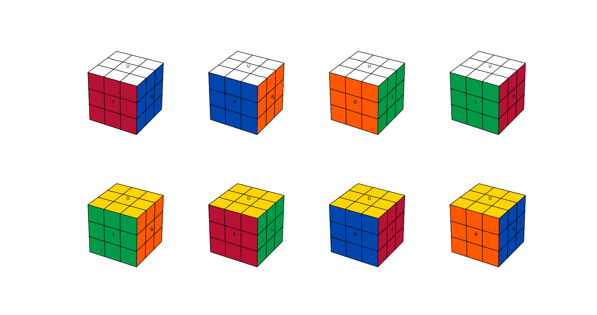
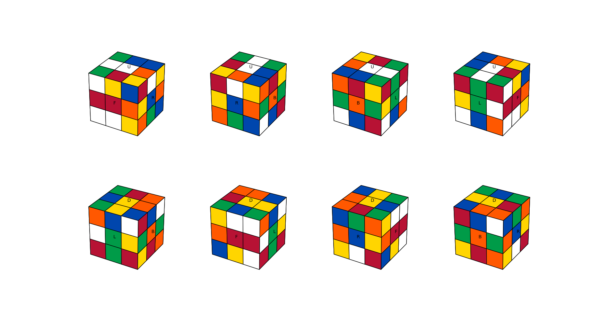
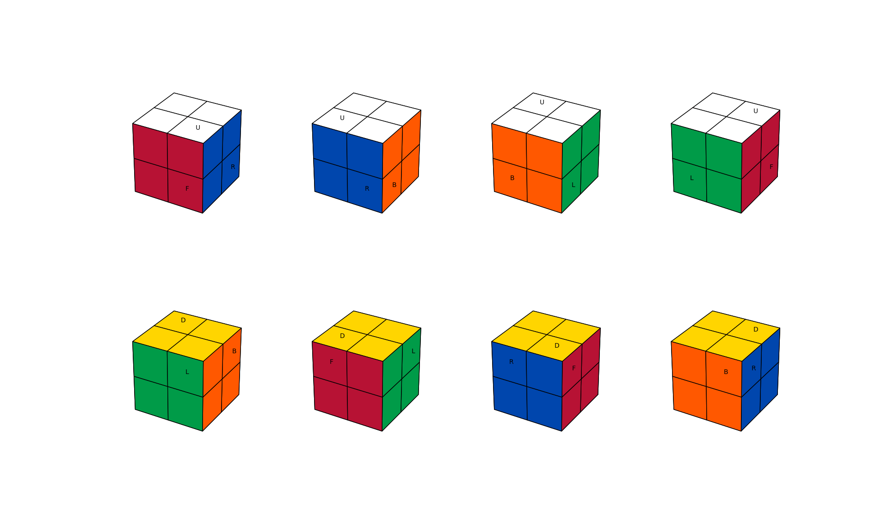
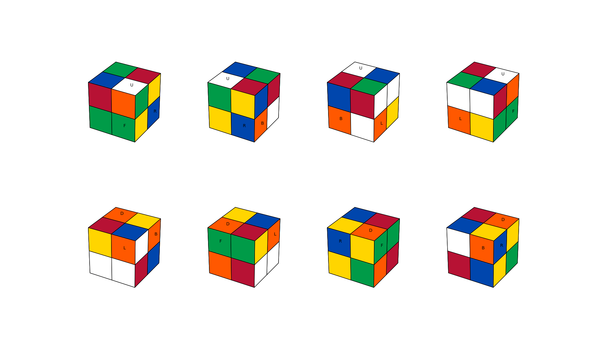

# Magic Cube

Start by running

```
python3 cube_mpl.py
```

Usage:

```
usage: cube_mpl.py [-h] [-n N] [-r R]

MagicCubeMPL

optional arguments:
  -h, --help  show this help message and exit
  -n N        cube size (only 2 or 3 are supported yet)
  -r R        amount of random rotations when initializing
```









# TODO
- implement solver
- allow n >= 4 and implement rotations for the mids (n >= 3)
